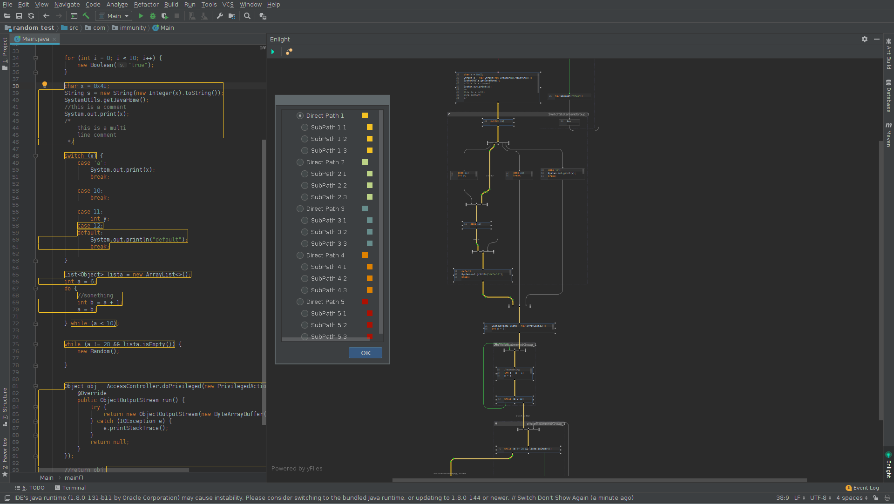

<h1 align="center">
  

      
  

</h1>

 

# Enlight - IntelliJ IDEA plugin

This plugin helps when doing source code review or auditing by generating flowchart diagrams of source code.

It fully integrates with many IntelliJ IDEA features that will hopefully make your life easier.

This plugin is only available for IntelliJ IDEA Ultimate editions.

Currently it supports Java source code.

# Introduction

This project was originated as a internal personal research project at Immunity Inc., conducted when not being engaged in consulting or exploit development.

I usually spend a lot of time auditing Java code and sometimes big implementations can be hard to read and follow.

Flowcharts and any kind of diagram are really helpful when trying to understand code.

IntelliJ IDEA has been for a long time the main tool I use to do code auditing so I wanted to improve my workflow somehow.

The result was this plugin which started with a simple idea of just creating a flowchart like the ones you normally see in IDA.

And then it mutated into a more ambitious project including more features that could help much more on security source code audits.

    

# Key Features

* Generates flowchart diagrams of any method implementation you select in an active editor.

* The plugin works at Java source code level. No need to compile code or have bytecode access. 
It even works with code that fails to compile. 
As long as the IDE can open the source code the plugin will create a diagram.

* Interprets and handles these control flow structures:
    * IF / ELSE
    * FOR
    * FOREACH
    * WHILE
    * DO / WHILE
    * SWITCH / CASE
    * TRY / CATCH / FINALLY

* Supports labeled continue and break statements in loops. 
Crazy people might use them kind of as a GOTO. 
And sometimes decompiled source code might use them as well.

* Searching and viewing all potential paths between two selected nodes

* Viewing all logical conditions that need to be met in order to follow a particular path between nodes

* Source code highlighting when selecting nodes on the diagram

* Double clicking an edge navigates and focus on the target node. Holding Ctrl + Shift while clicking navigates backwards to the source node.

* Setting custom colors to nodes and edges 

* Move around the graph view by holding CTRL + click and dragging

* Method call hierarchy integration

* Double clicking a method node navigates to source code and generates a new diagram

* Diagram generation history

* Highlights the corresponding diagram node based on code selected in the editor 

# Screenshots

# Architecture Overview

The plugin makes use of many really powerful features provided by IntelliJ IDEA.

It leverages the PSI (Program Structure Interface) API which is kind of an AST on steroids. Using PSI Elements the plugin can interpret any Java source code loaded in an open editor.

What makes this interesting is that it works at source code level, even with code that does not compile. There is no need of having a JAR file or bytecode.

In order to generate the graphs, the plugin makes use of the Diagramming API and UML Support plugin available only on IntelliJ IDEA Ultimate editions.
[https://www.jetbrains.com/help/idea/class-diagram.html] [https://confluence.jetbrains.com/display/IDEADEV/Diagram+Framework]

The diagramming API is powered by yFiles under the hood. yFiles is an amazing library for all kind of graphs developed by yWorks. 
This library is the same one that, for example, BinNavi uses [https://github.com/google/binnavi]

As you can see, yFiles requires a license so I guess that might be the reason why you can only use it on Ultimate editions.

Warning: Since I am not a formal Java developer, the plugin design and code might be a little ugly but gets the work done ;)

# Roadmap

* Exporting and saving diagrams

* Adding notes/comments to nodes and edges

* Exporting all conditions for a particular execution path in some format that can be later used with a solver

* Integrate Analyze Data Flow engine [https://www.jetbrains.com/help/idea/analyzing-data-flow.html] [https://blog.jetbrains.com/idea/2018/01/fumigating-the-idea-ultimate-code-using-dataflow-analysis/] [https://blog.jetbrains.com/idea/2018/06/improved-data-flow-analysis-in-intellij-idea-2018-2/]

* Develop custom Code Inspections to identify potential security issues [https://www.jetbrains.com/help/idea/code-inspection.html] [https://www.jetbrains.com/help/idea/creating-custom-inspections.html] [https://www.jetbrains.org/intellij/sdk/docs/tutorials/code_inspections.html]

* Automatically color nodes that contain code detected by custom Code Inspections to easily detect potentially dangerous code and highlight paths to them.

* Allow the user defining custom "sink" methods [based on regexes?] in order to automatically color nodes which contains code matching them. 

* Multi-highlight inside node's source code
 
* Integrate the IDE Debugger (be able to highlight current line and variable values as IntelliJ already does on the current editor) 

* Integrate with Code Coverage by highlighting nodes [https://www.jetbrains.com/help/idea/code-coverage.html]

# Not Yet Supported

* IntelliJ IDEA Community Edition

* Anonymous/inner classes with with inline methods. These are just represented as a code block.

* Lambda expressions

* Languages other than Java

# FAQ

* Q: Why does the plugin not work with IntelliJ IDEA Community Edition?

  A: The plugin makes use of the Diagramming API and UML Support plugin which are only available on Ultimate editions. Check [https://www.jetbrains.com/help/idea/class-diagram.html] 
  
* Q: Does the plugin support other languages?
  
  A: It only supports Java at the moment. However it is possible to add support for any other language supported by Jetbrains' IDEs for which there is PSI [https://www.jetbrains.org/intellij/sdk/docs/basics/architectural_overview/psi.html]
  Unfortunately I don't have enough time to work on more languages at the moment. So collaboration and PRs are welcomed :) 
  This will probably require some thought and refactoring but it can be done for sure!
     
* Q: Can I contribute?

  A: Yes, please! I will try my best to keep issues updated and organized so people can take items and do PRs. Check the [CONTRIBUTING](docs/CONTRIBUTING.md) section

* Q: How often will you release new versions?

  A: I hope being able of adding new features every couple of months but I am not sure. This is a project done during free work time. I have a 1 year old daughter so my free personal time is all family time :) 
 
* Q: I have errors or things are not working properly with the plugin. What do I do?

  A: Please create an issue with all the details or send an email. I really appreciate all feedback.
   
# [Getting Started](docs/GettingStarted.md)

# Development Environment Setup

TODO - Coming soon

# Contributing

Please check the [CONTRIBUTING](docs/CONTRIBUTING.md) section

# License

Apache License Version 2.0 - [LICENSE](LICENSE)

# Credits

* Esteban Guillardoy - @sagar38 - Lead Developer - esteban@immunityinc.com - eguillardoy@gmail.com
* Anibal Irrera - @airrera - Contributor
* Guillermo Mesyngier - https://dribbble.com/gmesyngier - Logo & icons

    
# Misc

This plugin has been greatly influenced by these other plugins:

* https://plugins.jetbrains.com/plugin/227-psiviewer
* https://plugins.jetbrains.com/plugin/7996-java-method-reference-diagram
* https://plugins.jetbrains.com/plugin/3202-code-navigator
* https://plugins.jetbrains.com/plugin/10503-controlflowgraph
* https://plugins.jetbrains.com/plugin/8286-sequencediagram
* https://plugins.jetbrains.com/plugin/1834-codegraph
* https://plugins.jetbrains.com/plugin/9345-jdt-astview
* https://plugins.jetbrains.com/plugin/8461-bytecode-editor
* https://plugins.jetbrains.com/plugin/11218-local-code-review-tool
* https://plugins.jetbrains.com/plugin/8351-code-comments
* https://plugins.jetbrains.com/plugin/7125-grep-console
* https://plugins.jetbrains.com/plugin/9511-multihighlight
* https://plugins.jetbrains.com/plugin/7622-php-inspections-ea-extended-