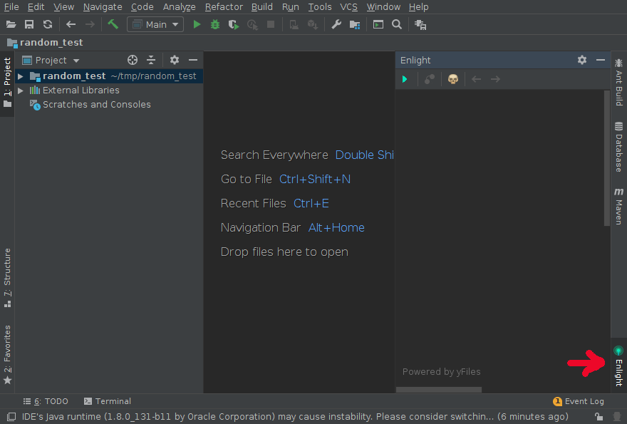

# Getting Started

## Installation
You can download a compiled version of the plugin from the Releases section.
Then open IntelliJ IDEA Ultimate and go to File => Settings (Ctrl + Alt + S) => Plugins => Install Plugin from Disk and select the downloaded file.

The plugin will soon be also available at [JetBrains Plugin Marketplace](https://plugins.jetbrains.com/) and you will be able to direcly install from there.

## General Usage
Enlight is available on the right side or your IDE as a secondary tool window, which can be shown and hidden as any other tool window

As long as you are working with Java code you can make use of this plugin to generate flowcharts of any method.

### Generating a flowchart
There are 2 ways of generating a flowchar for a particular Java method:

* In you opened editor put the cursor on any line of the method you want to work with. Then go to the Enlight toolwindow and click on the "Generate Flowchart" icon.

* In your opened editor right click on any line of the method you want to work with to open the context menu. Then in the context menu go to Enlight => Generate Flowchart.
 

### Navigating
Once your flowchart diagram is generated you can move around by holding CTRL while clicking and dragging around.

You can Zoom in and out using CTRL + mouse wheel.

The corresponding source code for any selected node in the diagram will be automatically highlighted on your editor and cursor will navigate there so you can easily follow the code.
 
If you have a complex diagram and want to determine the exact node that contains a particular line of code of the method you are working with you can navigate to the node by using the editor context menu:
right click on the line you want to find in the diagram => Enlight => Navigate to node containing current element

### Edges and conditions
Certain edges in the diagram hold logical conditions that explain when such path is taken, i.e. when having an IF statement.

When you select an edge, if it has a logical condition associated it will be displayed.

You can force displaying all edges conditions by right clicking anywhere in the diagrama and selecting option "Show Edges Labels" from the context menu.

### Coloring Nodes and Edges

You can change the color of any node or edge in the diagram simply by right clicking on the element and using the option "Change element color" from the context menu.

You can also change colors of multiple elements at the same time. Select multiple nodes or edges by holding SHIFT while clicking and then change their colors with the context menu.
Multiple elements can also be selected with the mouse by left clicking and drawing a rectangle.

(In this beta release you can't select nodes and egdes together, you either select multiple nodes or edges. There is an open issue for this)

If you want to clear all colors, just right click anywhere in the diagram and from the context menu select "Reset all elements colors".

### Call Hierarchy

IntelliJ IDEA [Call Hierarchy](https://www.jetbrains.com/help/idea/building-call-hierarchy.html) is integrated with Enlight.

You can view all callers to the method you are currenlty working with in Englight by right clicking anywhere in the diagram and selecting menu option "Get method callers".

This will add nodes to the diagram showing you all direct callers to the method. You can keep finding callers to any of the other methods by selecting a node or multiple nodes and using again the "Get method callers" menu option.

Whenever you get callers the Hierarchy tool window will also be opened, so you can have both ways of visualizing callers:
* Tree view in the Hierarchy tool window
* Graph view in Enlight

The Hierarchy tree of callers is also integrated to Enlight, so if you expand a tree element it will also trigger an action in Enlight to add those callers to the diagram.

If there is any caller in the diagram (a method node) that looks interesting you can double click on it and a new flowchart for it will be created. The corresponding file with the method's implementation will be opened in a new editor tab as well. 

### History
When working with Enlight you will probably generate flowcharts for many different methods or perhaps view callers and double click on some of them to view its diagram.

Enlight keeps a history of the diagrams and you can go back and forward using the arrow icons on Enlight's toolbar.

Since history is kept in memory, the plugin has a maximum value to limit memory usage. You can change this limit in the plugin settings.

Enlight will keep the history of the last X diagrams (being X the max limit which by default is 30)

### Searching paths between nodes

One of the most useful features of Enlight is the ability of showing all potential paths in the flowchart that can take you from one node to another.

To view paths simply select 2 nodes by holding SHIFT while clicking and then click on Enlight toolbar "Show paths between nodes" icon or right click on the diagram and select the context menu option "Show path between nodes". 

A new dialog with all potential direct paths as well as all sub paths that take loops will be displayed.
You can select any of the paths and Enligth will color all involved nodes and edges in the diagram as well as highlighting the corresponding source code in the active editor.

Custom colors for paths can be set by double clicking in each of color box next to the paths in the dialog.

## Settings

